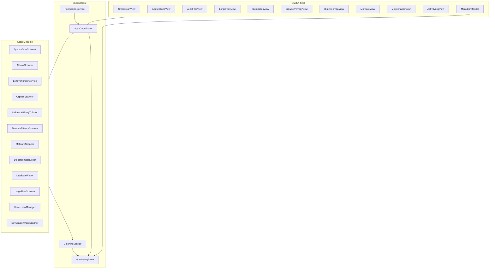

# Full Feature Plan (UI-first + MacSai + Pearcleaner)

## Priority rule

**First:** make every destination already in our UI fully working (no mocks/placeholders).

**Second:** add the remaining MacSai modules that are not in the current sidebar.

**Third:** add high-value Pearcleaner power tools (orphans, Homebrew, lipo UX, sensitivity, drag-drop).

References (inspiration only — keep our design system):

- [PureMac](https://github.com/momenbasel/PureMac) (MIT) — leftover matching / clean safety
- [MacSai](https://github.com/iliyami/MacSai) (BSD-3-Clause) — full cleaner module set
- [Pearcleaner](https://github.com/alienator88/Pearcleaner) (Apache 2.0 + **Commons Clause**) — uninstaller UX / orphans / Homebrew / lipo / Finder workflows

### License caution (Pearcleaner)

Pearcleaner’s Commons Clause **forbids monetizing Pearcleaner or modified versions of it**. We will **not copy Pearcleaner source**. Use it only as a product/feature checklist and UX reference; implement our own code (prefer PureMac/MacSai patterns where code-level inspiration is needed).

---

## MacSai feature gap check

| Feature | In previous plan? | In current UI? | Decision |
| --- | --- | --- | --- |
| Smart Scan (One-Click) | Partial (AI + stubs) | Yes (mock) | **In scope — make real first** |
| System Junk Cleaner | No (AI-only focus) | Yes as Junk Files (placeholder/mock) | **In scope — make real first** |
| Universal Binary Thinning | No | No | **Add** under System Junk |
| Malware Scanner | No | No | **Add** new sidebar module |
| Browser Privacy Cleaner | No | No | **Add** (Junk or Privacy sidebar) |
| Uninstaller + Leftover Detection | Yes | Yes (mock list) | **In scope — make real first** |
| Disk Treemap Visualizer | No | No | **Add** new sidebar module |
| Duplicate Finder | Out of scope before | Yes (placeholder) | **In scope — make real first** |
| Menu Bar System Monitor | No | No | **Add** |
| Maintenance Scripts | No | No | **Add** new sidebar module |
| In-App Activity Log Viewer | No | No | **Add** (sheet + sidebar entry) |

Also retained from earlier requirements:

- Accordion leftover folders on expand
- Claude / Codex / Cursor AI junk (plus Ollama/LM Studio)
- Trash-first deletion + FDA permissions

---

## Pearcleaner feature gap check

Source: [Pearcleaner README](https://github.com/alienator88/Pearcleaner) (project currently **On Hold** at v5.4.3; still the best reference for uninstaller-focused UX).

| Pearcleaner feature | In plan before this update? | Decision |
| --- | --- | --- |
| App Uninstall + leftover search | Yes (Wave A) | Keep; add **Strict / Enhanced / Deep** sensitivity UI |
| Orphaned File Search | No (deferred) | **Add in Wave A** — high value next to Applications |
| Development Environment Manager | No | **Wave C** — Xcode/npm/CocoaPods/Gradle-style caches |
| File Search | Partial via Large Files | Covered by Large Files + Treemap; no separate module |
| Homebrew Manager | Out of scope | **Wave C** — cache prune, leaves, formulae cleanup UI |
| App Lipo (strip arch, no Xcode tools) | Thinning only | **Strengthen** — per-app Lipo action + junk subcategory, bundle `lipo`/own Mach-O rewrite so Xcode CLI tools are not required |
| PKG Manager | No | **Wave C** — list/remove leftover package receipts |
| Plugin Manager | No | **Wave C** — Audio/Preference panes / Quick Look etc. |
| Services Manager | Partial via Maintenance | **Wave C** — enable/disable user LaunchAgents/Login Items UI |
| Apps Updater | Explicitly out | Stay out of scope for now |
| Drag/drop apps to uninstall | No | **Add in Wave A** Applications |
| Finder Extension right-click uninstall | No | **Wave C later** (extension target) |
| Sentinel (auto-clean when app hits Trash) | No | **Wave C optional** — FSEvents watcher on Trash |
| Prune unused app translations | Language files partial | Keep under System Junk / per-app action |
| Include/exclude search dirs + sensitivity | Sensitivity only implied | **Add** Settings: exclude paths + leftover sensitivity |
| List/Grid + web/iOS app badges | No | Optional polish; list-first with badge chips |
| Privileged Helper for system folders | Deferred | Still defer XPC helper; Trash + FDA first |
| CLI / deep links | No | Out of v1 |

---

## Existing UI destinations → must work first

Current sidebar in [`AppDestination`](mac_cleaner/Mock/MockData.swift) / [`ContentView`](mac_cleaner/ContentView.swift):

1. **Smart Scan** → real orchestrated multi-module scan + one-click clean selected
2. **Applications** → real apps + leftover accordion + uninstall (+ drag-drop, sensitivity)
3. **Junk Files** → System Junk categories + **AI Apps** category
4. **Large Files** → real large/old file finder (was placeholder)
5. **Duplicates** → real duplicate finder (was placeholder)
6. **Design System** → keep as developer gallery (no FS work)

Add **Orphans** next to Applications as soon as leftover engine exists (same Wave A), even if it was not in the original mock sidebar — it is core to Pearcleaner/PureMac value.

---

## Expanded sidebar (after UI is live)

Add destinations (same design language as [`AppSidebar`](mac_cleaner/Views/Shell/AppSidebar.swift)):

- **Orphans** — leftover files with no installed app (Wave A)
- **Privacy** — Browser Privacy Cleaner
- **Space Lens** — Disk treemap
- **Protection** — Malware Scanner
- **Maintenance** — maintenance scripts
- **Activity** — in-app log viewer
- **Homebrew** / **Developer** — Wave C Pearcleaner-style managers (can share a “Tools” group)

Menu bar monitor is a separate lightweight process/window (`MenuBarExtra` or helper target), toggled from Settings/sidebar.

---

## Architecture

### Shared foundation (build once)

- `PermissionService` — Full Disk Access probe, Settings deep-link, banner/sheet
- Project: **disable App Sandbox**; entitlements file; safety via allow-lists
- `CleaningService` — Trash-first, symlink resolve, path allow-list, chunked batches, cancellation
- `ActivityLogStore` — append-only log of scan/clean events/errors; prune after 30 days; feed Log Viewer
- `ScanModule` protocol — `id`, `title`, `scan()`, `items`, `totalSize`, selection defaults
- `ScanCoordinator` — parallel `TaskGroup` scans for Smart Scan; progress + cancel

---

## Wave A — Make current UI fully functional

### A0. Foundation

- Entitlements + FDA UI on Smart Scan / Junk / Applications
- Models: `JunkItem`, `JunkCategoryResult`, `InstalledApp`, `LeftoverItem`, `ScanProgress`, `CleanResult`
- `ActivityLogStore` + thin log sheet (even before full Log sidebar)

### A1. System Junk + AI Junk → Junk Files + Smart Scan inputs

System Junk categories (MacSai-inspired, practical set):

- User caches, system caches (safe subset), logs, temp files
- Mail downloads, iOS backups, Xcode DerivedData/Archives
- Broken preferences / broken login items (detect-only or careful clean)
- Language files (optional)
- Trash bins
- **AI Apps** — Claude / Codex / Cursor caches & logs (default-on); auth/history (default-off); plus Ollama/LM Studio
- **Universal Binary thinning** as a subcategory: detect fat Mach-O (arm64+x86_64), offer native-arch rewrite via `lipo` (never auto-run without confirm; show size savings)

Junk Files UI: category accordion → item list with checkboxes/sizes → Clean Selected.

### A2. Smart Scan (One-Click)

Rewrite [`SmartScanView`](mac_cleaner/Views/SmartScanView.swift):

- One primary **Scan** button runs coordinator across System Junk, AI Junk, Browser Privacy summary, Large Files summary, Duplicates count, Malware quick pass (when those modules exist; Wave A wires whatever is ready and expands as modules land)
- Live per-category progress rings/bars using existing [`AppProgressBar`](mac_cleaner/DesignSystem/Components/AppProgressBar.swift) / [`AppProgressRing`](mac_cleaner/DesignSystem/Components/AppProgressBar.swift)
- Category cards with totals; drill into Junk/Apps/etc.
- **Clean Selected** with confirm sheet; results feed Activity Log

### A3. Uninstaller with leftover detection (PureMac engine + Pearcleaner UX)

Rewrite [`ApplicationsView`](mac_cleaner/Views/ApplicationsView.swift):

- Real inventory from `/Applications` + `~/Applications`
- Accordion expand → lazy `LeftoverFinderService` (PureMac-style 10-level matching + Locations/Conditions)
- Show every folder/file to delete with path, kind, size, checkbox, Reveal
- Uninstall → confirm → Trash selected leftovers + app bundle
- Exclude Apple system apps
- **Pearcleaner UX adds:**
  - Drag/drop `.app` onto the window to open leftover review
  - Leftover **sensitivity** control: Strict / Enhanced / Deep (default Enhanced)
  - Optional per-app actions: **Lipo** (strip non-native arch), **Prune languages** (keep preferred localizations)
  - Settings: include/exclude search directories for leftover matching

### A3b. Orphaned File Search

New `OrphansView` using the same leftover location database:

- Walk Library search roots; keep items that do **not** match any installed bundle ID / app name
- Restrict auto-select to caches/logs (PureMac orphan safety); support/preferences require explicit check
- Clean selected → Trash + Activity Log

### A4. Large Files

Replace placeholder with scanner: files above configurable threshold (default 50–100 MB), sort by size / last access, select + trash, reveal in Finder.

### A5. Duplicate Finder

Progressive pipeline (MacSai-style):

1. Group by size
2. Partial SHA-256 (first 4KB)
3. Full hash
4. Inode / APFS clone awareness where possible

UI: groups with keep-one / trash others; confirm; log errors.

---

## Wave B — Remaining MacSai modules

### B1. Browser Privacy Cleaner

Safari / Chrome / Firefox / Arc (if present): history, cookies, cache with time filters. Default-off for history/cookies; caches default-on. FDA required for Safari.

### B2. Malware Scanner

Signature/heuristic pass over LaunchAgents/Daemons, known malware path patterns, suspicious browser extensions. Depths: Quick / Balanced / Deep. Quarantine = move to Trash + log. Not a replacement for XProtect/Gatekeeper — honest UI copy.

### B3. Disk Treemap Visualizer

Squarified treemap of chosen root (home / volume); drill-down; open folder; send large nodes to Large Files / Trash flow. New sidebar **Space Lens**.

### B4. Menu Bar System Monitor

`MenuBarExtra` (same app target first; split process later if needed): CPU, memory pressure, disk free, battery; click opens popover; jump-to-app actions; optional launch-at-login.

### B5. Maintenance Scripts

Tasks with severity tags (safe / disruptive): flush DNS, rebuild Launch Services, reindex Spotlight, free inactive memory (best-effort), empty Trash, thin local TM snapshots (confirm). Cancel long tasks. No silent root escalation in v1; use admin auth only where `osascript`/Authorization is required and allow-listed.

### B6. In-App Activity Log Viewer

Full viewer: filter All / Errors / Cleans / Scans; search; copy; prune 30 days; “View Log” from post-clean sheets.

---

## Wave C — Pearcleaner power tools

Implement after Waves A–B are solid. Feature ideas only from [Pearcleaner](https://github.com/alienator88/Pearcleaner); original code.

### C1. Homebrew Manager

- Detect `brew` prefix / `HOMEBREW_CACHE`
- List cache size, outdated formulae (read-only first), cleanup actions wrapping `brew cleanup` with confirm + log
- Never run destructive brew commands without explicit user confirm

### C2. Development Environment Manager

- Curated + discovered caches: Xcode DerivedData/Archives/Simulators (sizes), npm/yarn/pnpm, CocoaPods, Gradle, Cargo `target` (opt-in), Claude/Codex/Cursor already in AI Junk
- Select + Trash / run known-safe clean commands with confirm

### C3. PKG / Plugin / Services managers

- **PKG**: list receipts under `/private/var/db/receipts` / `pkgutil`; remove leftover receipts carefully (confirm; prefer user-domain)
- **Plugins**: Audio Units, Preference Panes, Quick Look, Internet Plugins — list + trash user-level
- **Services**: user LaunchAgents / Login Items list with enable-disable and leftover plist cleanup

### C4. Optional Sentinel + Finder extension

- **Sentinel-style**: watch Trash for `.app` additions; prompt to scan leftovers (low-RAM background)
- **Finder Sync / Service**: “Uninstall with Mac Cleaner” — after core uninstall is proven

---

## Safety rules (all waves)

- Trash-first deletion; confirm destructive batches
- Protected path blocklist (`/System`, `/usr`, `/bin`, `/sbin`, SIP)
- Symlink resolve + allow-list before delete
- Sensitive AI/browser items default unchecked
- System apps not uninstallable
- Cancellable scans; chunked cleans
- Every failure → Activity Log

---

## Out of scope (explicit)

- Apps Updater (Sparkle feeds) — Pearcleaner/MacSai have this; skip for v1
- Secure shredder overwrite modes
- Privileged XPC helper daemon — defer; Trash + FDA + user-level ops first
- Copying any Pearcleaner source (Commons Clause / monetization risk)
- Telemetry, paywalls
- Scheduled auto-clean (can follow later on same coordinator)
- CLI / deep-link automation (Pearcleaner has these; post-v1)

---

## Implementation order

1. Foundation (FDA, CleaningService, ActivityLog, ScanModule protocol)
2. System Junk + AI Junk + Junk Files UI
3. Applications leftover accordion + uninstall + sensitivity + drag-drop
4. Orphan finder
5. Large Files + Duplicates
6. Smart Scan orchestration over live modules
7. Universal Binary / App Lipo (no Xcode dependency)
8. Browser Privacy + Malware
9. Treemap + Maintenance + Activity Log sidebar
10. Menu Bar monitor
11. Wave C: Homebrew, Dev Environment, PKG/Plugins/Services
12. Optional: Sentinel Trash watcher, Finder extension
13. Polish: remove mocks, badges, shortcuts ⌘R/⌘K/⌘1–9, tests

## Key files

- [`ContentView.swift`](mac_cleaner/ContentView.swift), [`AppSidebar.swift`](mac_cleaner/Views/Shell/AppSidebar.swift), [`MockData.swift`](mac_cleaner/Mock/MockData.swift) — expand `AppDestination`
- [`SmartScanView.swift`](mac_cleaner/Views/SmartScanView.swift), [`ApplicationsView.swift`](mac_cleaner/Views/ApplicationsView.swift)
- Replace [`PlaceholderDestinationView`](mac_cleaner/Views/PlaceholderDestinationView.swift) usages for Large/Duplicates
- New trees: `Core/`, `Services/`, `Modules/`, `ViewModels/`, `Views/{Junk,Applications,Orphans,Files,Privacy,Protection,Maintenance,SpaceLens,Activity,MenuBar,Homebrew,Developer}/`
- [`project.pbxproj`](mac_cleaner.xcodeproj/project.pbxproj) — sandbox off, entitlements
